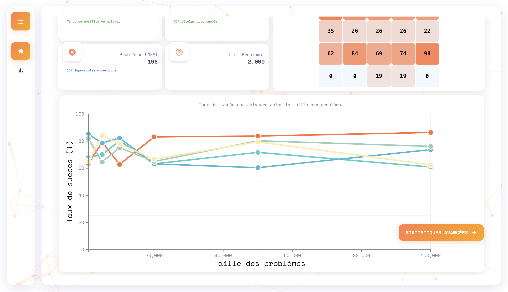
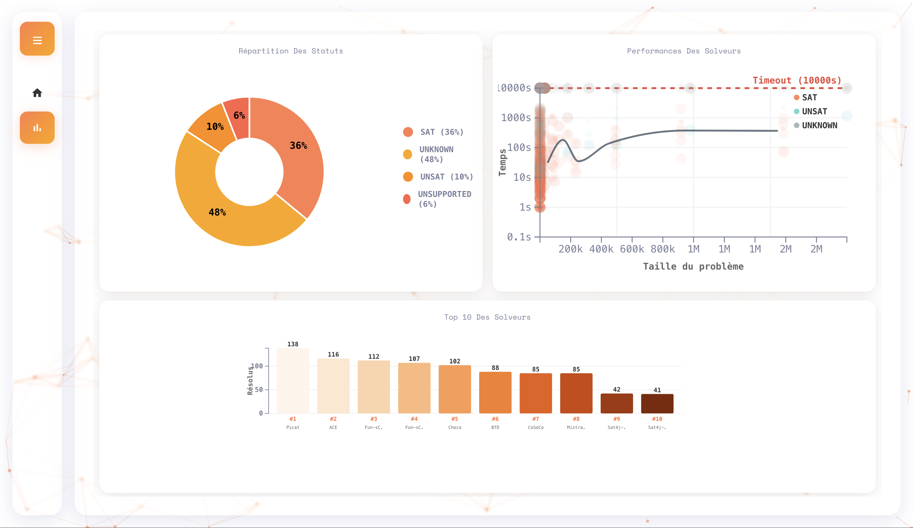

# Dashboard - Visualisateur de données

> Dashboard interactif pour l'analyse et la visualisation de données de résolution 
Prévisualiser -> https://data.hkth.dev

## Fonctionnalités

- **Tableau de bord principal** avec métriques clés (taux de succès, problèmes SAT/UNSAT)
- **Visualisations interactives** : graphiques en secteurs, scatter plots, heatmaps
- **Timeline des performances** des solveurs selon la taille des problèmes
- **Classement des solveurs** avec analyse comparative
- **Interface responsive** avec animations fluides
- **Écran de chargement** avec barre de progression
- **Navigation sidebar** intuitive
- **Effets de particules** en arrière-plan

## 📸 Aperçu


*Interface principale avec métriques et graphiques interactifs*


*Vue détaillée avec visualisations avancées et classement des solveurs*

## 🛠️ Technologies

| Frontend | Visualisation | Styling |
|----------|---------------|---------|
| HTML5 | D3.js v7 | CSS3 |
| JavaScript ES6+ | SVG | Material Design |
| Vanilla JS | Canvas | Space Mono Font |
| | Particles.js | Material Icons |

## 📊 Types de graphiques

- **Heatmap** : Distribution des statuts par solveur
- **Timeline** : Évolution des performances dans le temps
- **Pie Chart** : Répartition des statuts de résolution
- **Scatter Plot** : Relation taille/temps d'exécution
- **Bar Chart** : Classement des meilleurs solveurs

## 📁 Structure du projet

```
DataDashboard/
├── index.html              # Page principale
├── public/
│   ├── css/
│   │   └── style.css       # Styles personnalisés
│   └── js/
│       ├── background.js   # Effets de particules
│       ├── charts.js       # Graphiques D3.js
│       ├── loader.js       # Écran de chargement
│       ├── script.js       # Logic principale
│       └── sidebar.js      # Navigation
└── README.md
```

## 🎯 Source des données

Les données sont récupérées depuis l'API :
- **URL** : `https://www.cril.univ-artois.fr/~lecoutre/teaching/jssae/code5/results.json`
- **Format** : JSON avec résultats de solveurs SAT
- **Contenu** : Statuts (SAT/UNSAT/UNKNOWN), temps d'exécution, tailles de problèmes

## 👥 Équipe de développement

**Groupe 2B2**
- **Ahmad Ait Amy** - Développeur Frontend
- **Heck Théo** - Développeur Frontend & Visualisations

## 📝 Licence

Ce projet a été développé dans le cadre d'un projet académique.

---

*Dashboard créé pour l'analyse de performances de solveurs - 2026*
